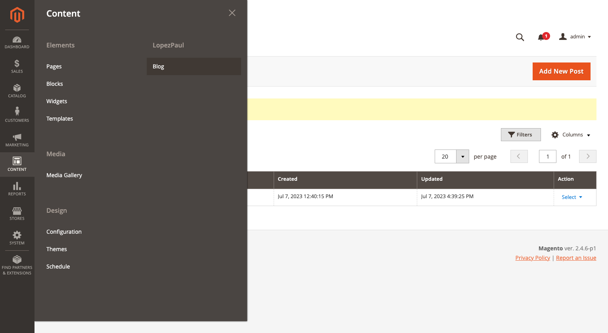
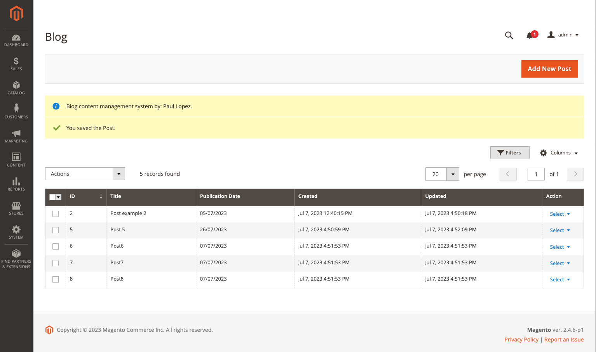
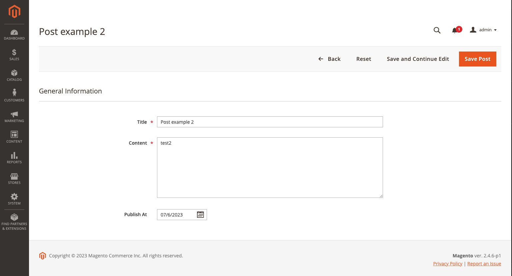
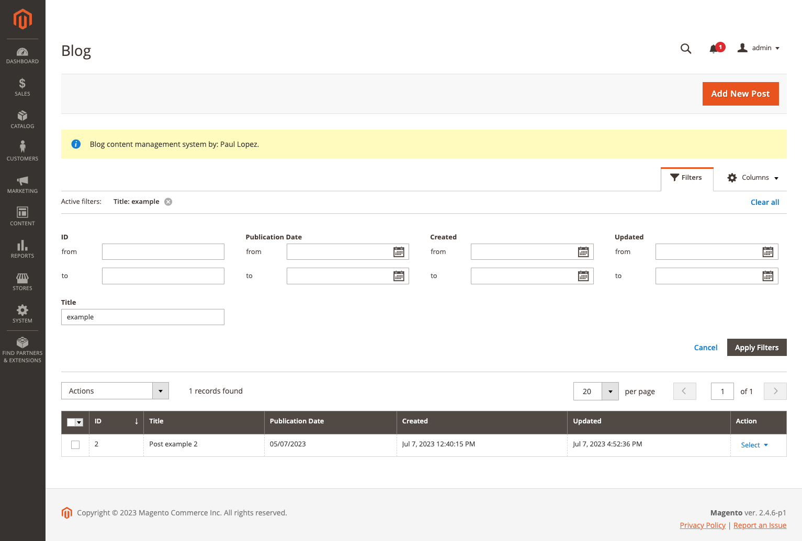
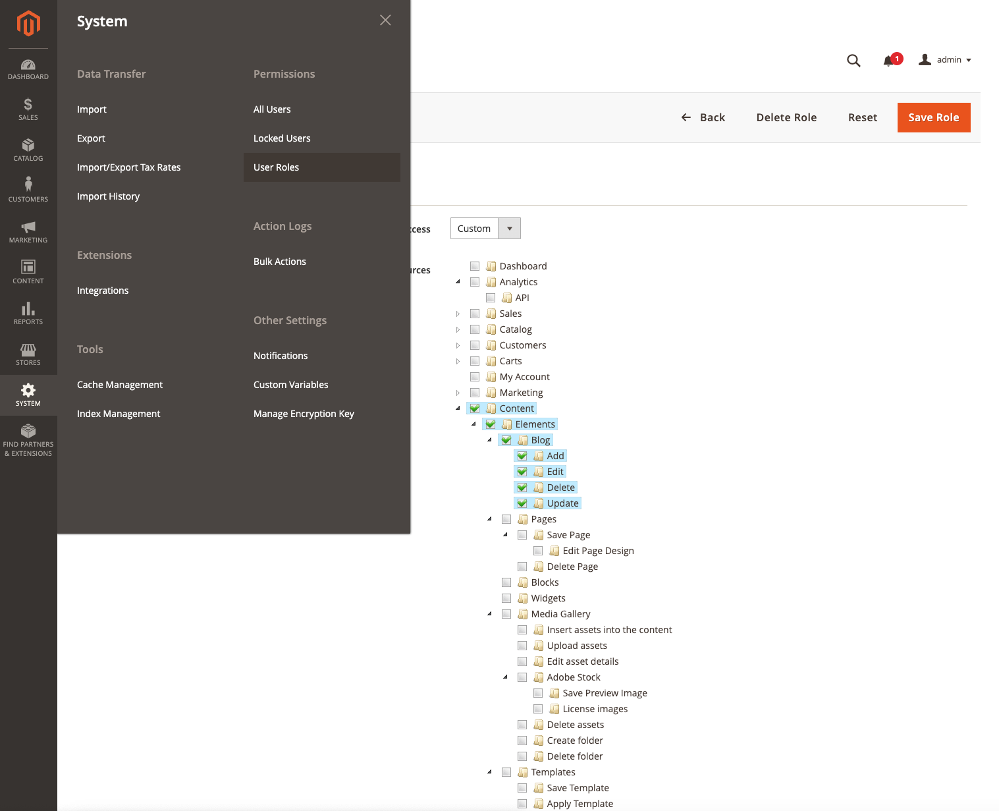
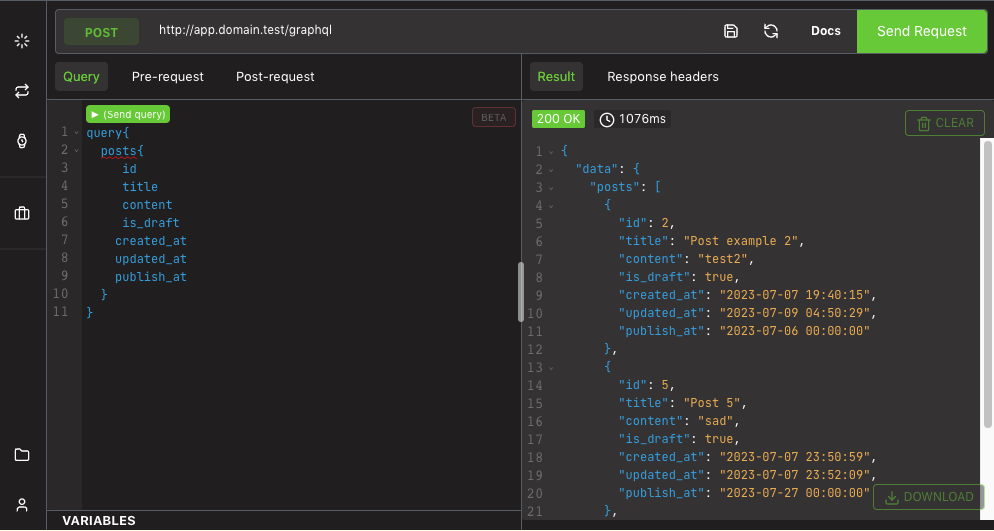

<h1 align="center">LopezPaul Blog</h1> 
<div align="center">
  <p>Blog module for Adobe Commerce.</p>
  
  <a href="https://github.com/lopezpaul/magento2-modules" target="_blank">
    </a>
  <a href="https://opensource.org/licenses/MIT" target="_blank">
    
    </a>
</div>

## Table of contents

- [Summary](#summary)
- [Installation](#installation)
- [Usage](#usage)
- [Dependencies](#dependencies)
- [GraphQL](#graphql)

---
## Summary

---

Create Admin Grid for manage Post table "lopezpaul_blog_post" with columns:

- id
- title
- content
- is_draft
- created_at
- updated_at
- publish_at


## Installation

---
```
composer require lopezpaul/magento2-blog
bin/magento module:enable Lopezpaul_Blog
bin/magento setup:upgrade
```


## Usage

---
Enter to admin panel and login and go to `Content > LopezPaul > Blog`


See list of post


Create or edit post


Search post

You can use any filter and apply them to search Posts.

Permissions

Create User roles with the right permissions.


## Dependencies

---

- Magento_Backend
- Magento_Ui


## Permissions

---
You can create new Role to set the right permissions

## GraphQL

---

Go to your magento `<domain_url>/graphql`
```
query{
  posts{
    id
    title
    content
    is_draft
    created_at
    updated_at
    publish_at
  }
}
```
